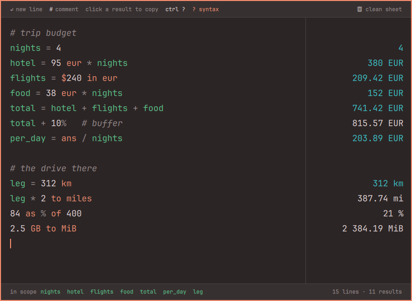

<p align="center"></p>

# Omasum

Omasum is a calculator for Omarchy that works like a notepad: summon it with a key, type lines of plain text, and each line's result appears beside it as you type.

<p align="center"></p>

It is an [Omarchy 4](https://omarchy.org) shell plugin: QML for the surface, plain JavaScript for the engine, running inside the shell the desktop already keeps alive. No daemon, no binary, no build step. Colours come from the active Omarchy theme and repaint when you switch themes.

## Install

```bash
omarchy plugin add https://github.com/nursahketene/omasum.git --enable
```

Then add the keybind. Omarchy 4 reads Hyprland bindings from **`~/.config/hypr/bindings.lua`** — the old `bindings.conf` is still on disk after the upgrade but is no longer loaded, so paste this into the `.lua` file:

```lua
o.bind('SUPER + SHIFT + Q', 'Omasum', 'omarchy-shell shell toggle dev.nur.omasum')
```

`SUPER + SHIFT + Q` is free in the stock Omarchy 4 bindings (the stock calculator is on `SUPER + CTRL + Q`). Pick another combination if it collides with one of yours.

Updates come with `omarchy plugin update dev.nur.omasum`, which shows you the diff before applying it.

`omarchy plugin add` puts the repository at `~/.config/omarchy/plugins/dev.nur.omasum` — the directory is named after the plugin id. A checkout or symlink of your own at that path works the same way; run `omarchy plugin validate` on it, then `omarchy plugin enable dev.nur.omasum`.

### Removing it

```bash
omarchy plugin remove dev.nur.omasum
```

That deletes the plugin directory and its entry in `~/.config/omarchy/shell.json`. Remove the `o.bind` line from `bindings.lua` yourself. Your sheet stays at `~/.local/state/omasum/sheet.calc` and the rates cache at `~/.cache/omasum/rates.json`; delete those two directories if you want nothing left behind.

### Dependencies

Everything it needs ships with Omarchy 4: the shell (Quickshell 0.3+, Qt 6), `wl-copy` and `wl-paste` from `wl-clipboard` for the clipboard, and `mkdir` for its two directories. Currency conversion makes one HTTPS request a day to `api.frankfurter.dev` for ECB reference rates; nothing else touches the network, and the plugin works offline without currency conversion. No API keys, no other services, no packages to install.

The plugin writes only to its own two directories above. It never edits your Hyprland, shell or theme configuration.

## Using it

- Every line is live. There is nothing to submit; the sheet re-evaluates as you type.
- `name = value` defines a name for every line below it. `ans` and `last` hold the previous result.
- `#` starts a comment, at the start of a line or after an expression.
- Click a result to copy the bare number. `Escape` hides the sheet and keeps everything; `clean sheet` in the top bar is the only thing that empties it, and `Ctrl+Z` undoes that too.
- `? syntax` in the top bar (or `Ctrl+?`) opens the full reference.

Some of what it understands:

| Type | Result |
| --- | --- |
| `2 + 3 * (4 - 1)^2` | `29` |
| `1_000_000 / 7` | `142 857.14` |
| `18% of 240` · `240 + 18%` · `84 as % of 400` | `43.2` · `283.2` · `21 %` |
| `20 km to miles` · `92 f to c` · `90 min in h` | `12.4274 mi` · `33.3333 °C` · `1.5 h` |
| `2.5 GB to MiB` | `2 384.19 MiB` |
| `$120 in eur` · `65 eur to try` | ECB daily rates |
| `255 to hex` · `0b1010 * 2` | `0xFF` · `20` |
| `sqrt(2) * 10` · `2pi` · `min(1,2)` | `14.1421` · `6.2832` · `1` |

The sheet autosaves to `~/.local/state/omasum/sheet.calc` — plain text, exactly what you typed. Currency rates are fetched from the ECB (via [Frankfurter](https://frankfurter.dev)) and cached in `~/.cache/omasum/rates.json`; a result computed from rates older than a day is tagged `rate`, and without any cache currency conversion says `rates unavailable` while everything else keeps working.

## Hacking on it

```
Omasum.qml    the window, bars, help screen, persistence, rates
Sheet.qml     the editor, the coloured layer behind it, the result column
Theme.qml     the eleven colour tokens, bound to the shell's Color and Style
Help.qml      the syntax reference
engine.js     lexer, parser, units, percentages, bases, formatting, evaluator
colour.js     OKLCH maths, the derived accent2 and the contrast guard
```

`engine.js` and `colour.js` are plain JavaScript with no QML in them, so the tests run outside the shell:

```bash
node --test test/
```

The plugin is `keepLoaded`, so the shell keeps one instance alive between summons and the sheet comes back exactly as you left it. That also means code changes need `omarchy-restart-shell` rather than the automatic reload. Logs land in the shell's log: `qs log -p $OMARCHY_PATH/shell -t 50`.

## Licence

MIT
