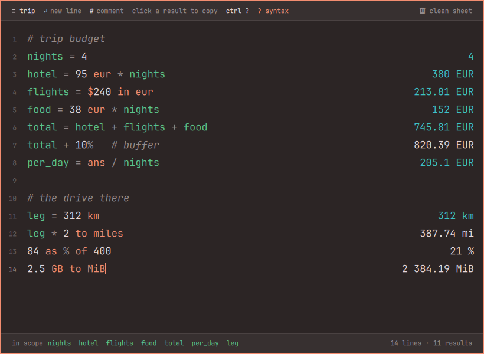

<p align="center"></p>

# Omasum

Omasum is a calculator for Omarchy that works like a notepad: summon it with a key, type lines of plain text, and each line's result appears beside it as you type.

<p align="center"></p>

It is an [Omarchy 4](https://omarchy.org) shell plugin: QML for the surface, plain JavaScript for the engine, running inside the shell the desktop already keeps alive. No daemon, no binary, no build step. Colours come from the active Omarchy theme and repaint when you switch themes.

## Install

```bash
omarchy plugin add https://github.com/nursahketene/omasum.git --enable
```

Then add the keybind. Omarchy 4 reads Hyprland bindings from **`~/.config/hypr/bindings.lua`** — the old `bindings.conf` is still on disk after the upgrade but is no longer loaded, so paste this into the `.lua` file:

```lua
o.bind('SUPER + SHIFT + Q', 'Omasum', 'omarchy-shell shell toggle dev.nur.omasum')
```

`SUPER + SHIFT + Q` is free in the stock Omarchy 4 bindings (the stock calculator is on `SUPER + CTRL + Q`). Pick another combination if it collides with one of yours.

`omarchy plugin add` puts the repository at `~/.config/omarchy/plugins/dev.nur.omasum` — the directory is named after the plugin id. A checkout or symlink of your own at that path works the same way; run `omarchy plugin validate` on it, then `omarchy plugin enable dev.nur.omasum`.

### Updating it

```bash
omarchy plugin update dev.nur.omasum
omarchy-restart-shell
```

The update shows you the diff before applying it. The restart is needed because Omasum stays loaded in the shell, so the old version keeps running until the shell restarts. The bar blinks for a few seconds while it comes back.

### Removing it

```bash
omarchy plugin remove dev.nur.omasum
```

That deletes the plugin directory and its entry in `~/.config/omarchy/shell.json`. Remove the `o.bind` line from `bindings.lua` yourself. Your sheets stay in `~/.local/state/omasum/` and the rates cache at `~/.cache/omasum/rates.json`; delete those two directories if you want nothing left behind.

### Dependencies

Everything it needs ships with Omarchy 4: the shell (Quickshell 0.3+, Qt 6), `wl-copy` and `wl-paste` from `wl-clipboard` for the clipboard, `curl` for the rates, and `mkdir` for its two directories. Currency conversion makes one HTTPS request a day to `api.frankfurter.dev` for ECB reference rates — via `curl` with a 15-second and 64 KiB limit, HTTPS only, no redirects; the response is validated before anything is cached. Nothing else touches the network, and the plugin works offline without currency conversion. No API keys, no other services, no packages to install.

The plugin writes only to its own two directories above. It never edits your Hyprland, shell or theme configuration.

## Using it

- Every line is live. There is nothing to submit; the sheet re-evaluates as you type, and long lines wrap at the result column.
- `name = value` defines a name for every line below it. `ans` and `last` hold the previous result. Start typing a name and a faint preview after the line offers the closest match with its current value; `Tab` finishes it.
- Lines are numbered in the gutter. `@n` then `Tab` pastes line n's exact result in its place, units included (`10/3` pastes as `3.3333333333333335`, `5 kg` as `(5 kg)` inside a longer expression). The preview shows what Tab will insert, or why it can't: Tab only completes when line n has a valid result. It is a copy, not a link, so it won't follow later edits to line n; `Ctrl+Z` turns it back into `@n`.
- `#` starts a comment, at the start of a line or after an expression.
- Click a result to copy the bare number.
- `Escape` hides the sheet and keeps everything. `clean sheet` in the top bar empties the open sheet, and `Ctrl+Z` undoes that too.
- `? syntax` in the top bar (or `Ctrl+?`) opens the full reference.

### Sheets

One sheet is the default, but you can keep as many as you like. `Ctrl+O`, or the sheet's name at the left of the top bar, opens a tray with every sheet, most recently used first. Omasum always opens on the sheet you used last.

| In the tray | |
| --- | --- |
| `Up` / `Down`, `Enter` or a click | switch to a sheet |
| `Ctrl+Enter` or a double-click | rename it; `Enter` saves, `Escape` cancels |
| `Ctrl+N` or `+` | start a new sheet (works outside the tray too) |
| `Ctrl+D` or the trash icon | ask to delete; `Ctrl+D` or `Enter` again deletes it and its file for good, `Escape` keeps it |
| `Escape` | close the tray |

Deleting the open sheet opens the next most recent one; deleting the last one leaves a fresh empty sheet. While the tray is open the bottom bar shows its keys.

Some of what it understands:

| Type | Result |
| --- | --- |
| `2 + 3 * (4 - 1)^2` | `29` |
| `1_000_000 / 7` | `142 857.14` |
| `18% of 240` · `240 + 18%` · `84 as % of 400` | `43.2` · `283.2` · `21 %` |
| `20 km to miles` · `92 f to c` · `90 min in h` | `12.4274 mi` · `33.3333 °C` · `1.5 h` |
| `2.5 GB to MiB` | `2 384.19 MiB` |
| `$120 in eur` · `45€ to £` · `65 eur to try` | ECB daily rates; `€ $ £ ¥ ₺ ₹ ₩ ₪ ₱ ฿` work before or after the number |
| `255 to hex` · `0b1010 * 2` | `0xFF` · `20` |
| `sqrt(2) * 10` · `2pi` · `min(1,2)` | `14.1421` · `6.2832` · `1` |

Sheets autosave to `~/.local/state/omasum/` as plain text, exactly what you typed: the first is `sheet.calc`, later ones `sheet-<id>.calc`, and `sheets.json` keeps their names and order. Currency rates are fetched from the ECB (via [Frankfurter](https://frankfurter.dev)) and cached in `~/.cache/omasum/rates.json`; a result computed from rates older than a day is tagged `rate`, and without any cache currency conversion says `rates unavailable` while everything else keeps working.

## Hacking on it

```
Omasum.qml    the window, bars, help screen, sheets and their files, rates
Sheet.qml     the editor, the coloured layer behind it, the result column
SheetTray.qml the sheets tray: the list, renaming, new and delete
Theme.qml     the eleven colour tokens, bound to the shell's Color and Style
Help.qml      the syntax reference
engine.js     lexer, parser, units, percentages, bases, formatting, evaluator
colour.js     OKLCH maths, the derived accent2 and the contrast guard
```

`engine.js` and `colour.js` are plain JavaScript with no QML in them, so the tests run outside the shell:

```bash
node --test test/
```

The plugin is `keepLoaded`, so the shell keeps one instance alive between summons and the sheet comes back exactly as you left it. That also means code changes need `omarchy-restart-shell` rather than the automatic reload. Logs land in the shell's log: `qs log -p $OMARCHY_PATH/shell -t 50`.

## Licence

MIT
